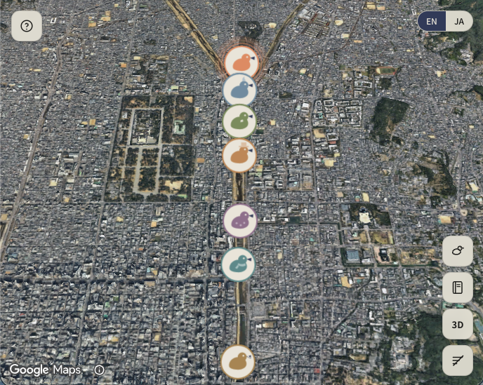
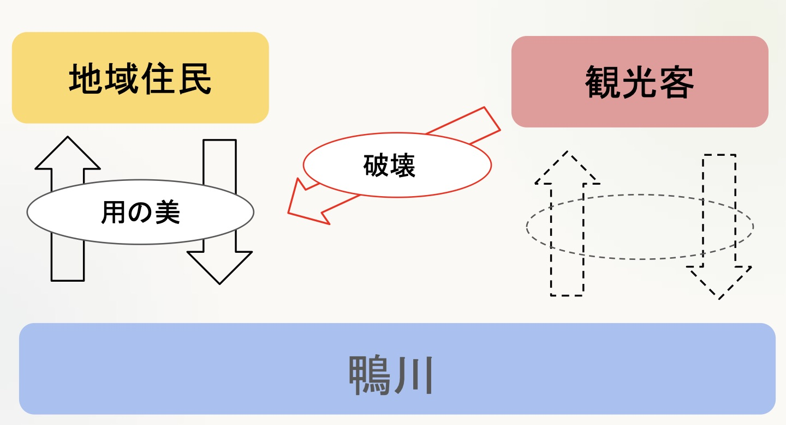
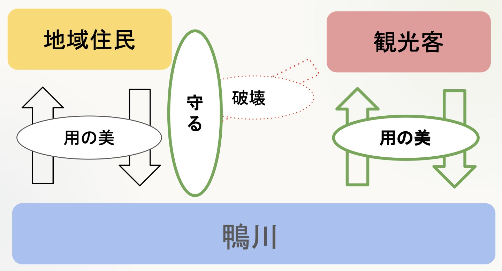
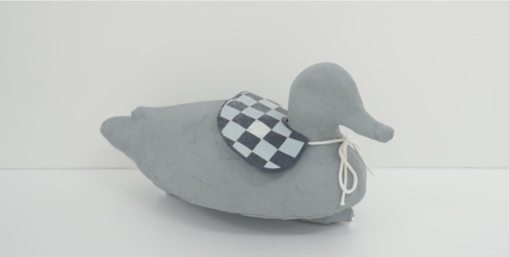
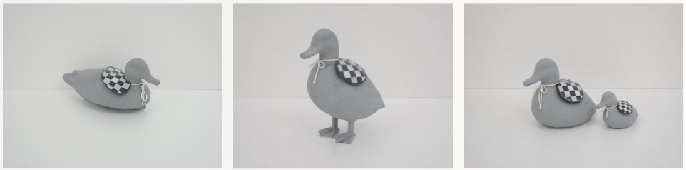
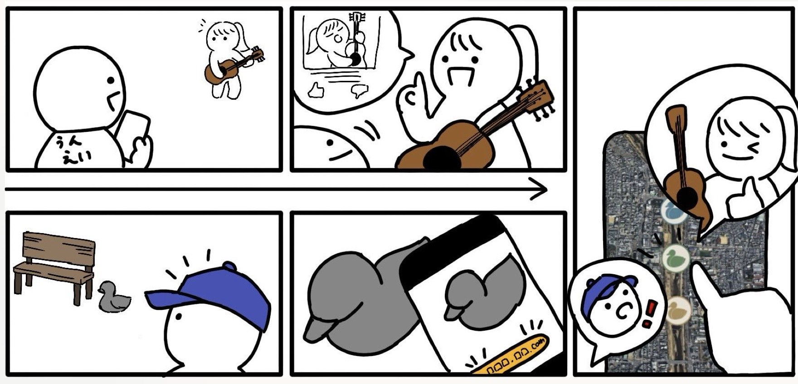
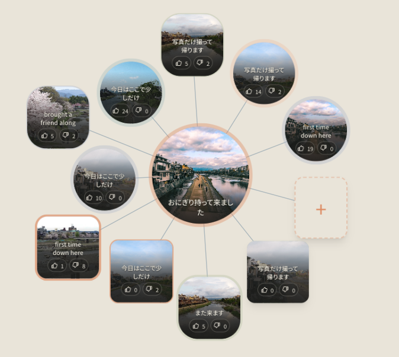
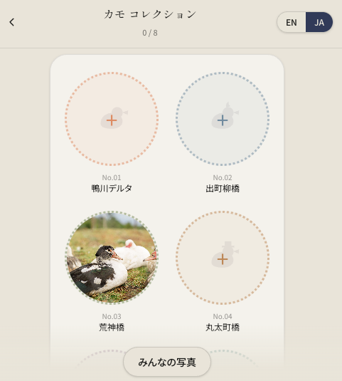

# KAMOGAWA COMMONS

**English** | [日本語](README.ja.md)

*Everyday Moments by the Kamogawa.* A mobile web app that helps visitors learn
the unwritten etiquette of Kyoto's Kamogawa riverbank. Visitors learn it by
seeing what local people actually do there, not by reading rules.

**Live:** https://kamocomo.vercel.app

  

A team project for インタラクションデザインⅡ (Interaction Design II), 2026.

## The problem

Kamogawa is a river where everyone spends time their own way. People read,
play music, picnic, and walk dogs side by side. That shared freedom rests on
暗黙知 (*anmokuchi*, tacit knowledge): habits that nobody writes down but most
locals follow.

- Sit at a comfortable distance from other groups.
- Keep the path clear for people who walk or cycle.
- Take your rubbish home.
- Respect other people's quiet time.

Overtourism is wearing these habits down. Some visitors swim in the river as if
it were a beach, sit across the path, or play loud music. Signs and rules are
the obvious fix. But rules would remove the freedom that makes the Kamogawa
what it is.

The team's question: **how can the river stay free and still pass on its
unwritten manners?**

| Now | Goal |
|---|---|
|  |  |

**Now:** residents (地域住民) use the river in a way that fits it, which the
team calls 用の美 (beauty of use). Visitors (観光客) have no such relationship
yet, and their behavior damages (破壊) the residents' one. **Goal:** residents
protect (守る) their relationship, and visitors build their own.

## Insight

Tacit knowledge is discovered, not taught.

- **Teaching** means rules, notices, and signs. The river loses its freedom.
- **Discovering** means watching the people nearby and reading the room.
  Visitors then join the culture in their own way.

## Concept: design the experience of discovering culture

The design has two parts. A physical object brings visitors in. A web app shows
them what people do at each spot.

### Kamo-Jizo (鴨地蔵): the way in

  

A duck figure modeled on the jizo statues that stand on Kyoto street corners.

- **Kyoto:** people in Kyoto have known and loved jizo for generations.
- **Kamogawa:** a duck by the river makes people want to take a photo.
- **Entry point:** taking that photo leads people to the app.

**Find it → photograph it → meet the river's culture.**

### The web app: where residents and visitors meet

*Top row (residents): an everyday moment by the river becomes a post. Bottom
row (visitors): a visitor finds a Kamo-Jizo, photographs it, and finds that
moment on the map.*

**Residents share their everyday.** A main post (親投稿) records what someone
does at a spot.

1. Choose a place on the map.
2. Choose an activity type, such as reading or music.
3. Write a short phrase.
4. Add a photo.

**Visitors discover it.** A visitor scans the QR code at a Kamo-Jizo to open
the app. A 3D map shows the visitor's location and the places along the river.
At each place, the visitor sees what people do there. The visitor then adds a
sub post (子投稿) under an activity they like. The sub post stays attached to
that main post.

### The community curates itself

  

The app has no report button. Votes do the work.

- **10 dislikes hide a post.** A database trigger hides it.
- **Likes change a sub post's shape.** A sub card starts square and gets
  rounder with each like. At 10 likes it is a circle, the same shape as its
  main post.

Unwanted behavior drops out of view. Welcome behavior becomes more visible.
Over time, the boards build a record of the river's tacit knowledge.

### Kamo Collection

  

Eight Kamo-Jizo spots line the river, from the Kamogawa Delta to Gojo Bridge.
Visitors collect each spot by scanning its QR code or by taking a photo there.
The server grants a stamp only within 120 m of the spot. Collecting all eight
unlocks a certificate.

The team made several Kamo-Jizo designs, so each find can be a small surprise.
Collecting their own photos of each figure gives visitors a reason to keep
exploring.

## Field test

The team placed a Kamo-Jizo at the Kamogawa Delta in the evening. **2 of the 3
groups that walked past stopped to photograph it.** The sample is small. The
result suggests that the figure can draw people in without a sign.

## Design principle: 用の美 (beauty of use)

用の美 is a Japanese craft idea: beauty that comes from everyday use. The team
checked both parts of the design against four qualities.

| | Web app | Kamo-Jizo |
|---|---|---|
| **Time** (時間) | Posts build up, so the culture carries forward. | It stays in place and becomes part of the scenery. |
| **Room to explore** (余白) | Visitors add their own experiences. | People choose how to engage: find it, photograph it, collect it. |
| **Relationships** (間柄) | Main and sub posts connect residents and visitors. | It connects visitors with the river's culture. |
| **People first** (人中心) | Culture passes on through what people do, not through rules. | Taking a photo leads people to the website. |

## Try it

Open https://kamocomo.vercel.app. The app is designed for phones. Switch
languages with the EN/JA toggle.

1. Watch the intro fly from space to the Kamogawa Delta. On a first visit,
   answer three short questions and read the tutorial.
2. Tap a duck marker. The camera flies to that place. Tap **More activities**
   to open the place's board.
3. On the board, like or dislike a sub post. Hold a card to see it in full. Tap
   **+** to add a sub post, or **Post an activity** to add a main post.
4. Back on the map, open the **Duck collection**. Turn on **Test mode** to
   collect ducks without being at the river.
5. Open the **Kamogawa Log** to see how each place has been used over time.

## My role

Engineer and designer, one of six team members. I built the whole app:
frontend, database, map integration, and deployment. I also worked with the
team on the concept and the interaction design.

## Engineering highlights

- **The database enforces the rules.** Postgres row-level security, triggers,
  and RPCs enforce one vote per person, the 10-dislike hide, and the 120 m
  distance check for stamps. They also cap each main post at 10 sub posts and
  move older ones to the archive. The client's checks only improve the
  interface.
- **No accounts.** Supabase anonymous sign-in gives each device an identity.
  Visitors use the app without signing up.
- **A 3D map at ¥0 a month.** Google Maps `Map3DElement` renders the river. The
  camera stays inside the Kamogawa corridor. A daily quota cap keeps map loads
  inside Google's free allowance.
- **Built for a weak signal.** Boards, the archive, and the collection save
  their last result in IndexedDB. A service worker caches the app shell. When
  the phone is offline, the app shows saved content instead of a blank page.
- **Live, bilingual boards.** Supabase Realtime sends new posts and votes to
  every open board. A d3-force layout arranges the posts. Every string exists
  in Japanese and English.

## Tech stack

- React 18, TypeScript, Vite, React Router, Zustand
- Google Maps Platform: `Map3DElement` for 3D, the classic Maps JavaScript API for 2D
- Supabase: Postgres, anonymous auth, Storage, Realtime
- Tailwind CSS v4, i18next, d3-force
- localforage and `vite-plugin-pwa` for offline support
- Hosted on Vercel

## Team

Team 2 (二班), インタラクションデザインⅡ, 2026:
菊田 あやめ, 加谷 圭, 木村 美尋, 林 憲生, 服部 愛子, Muhammad Naimi Nafis bin Norlisam

## More

- [Setup guide](docs/SETUP.md): run the app locally or deploy your own copy
- [Architecture](docs/ARCHITECTURE.md): screens, data model, and design tokens
- [Security notes](docs/SECURITY.md): what was tested with a visitor's privileges
